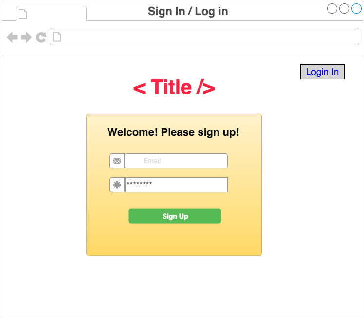
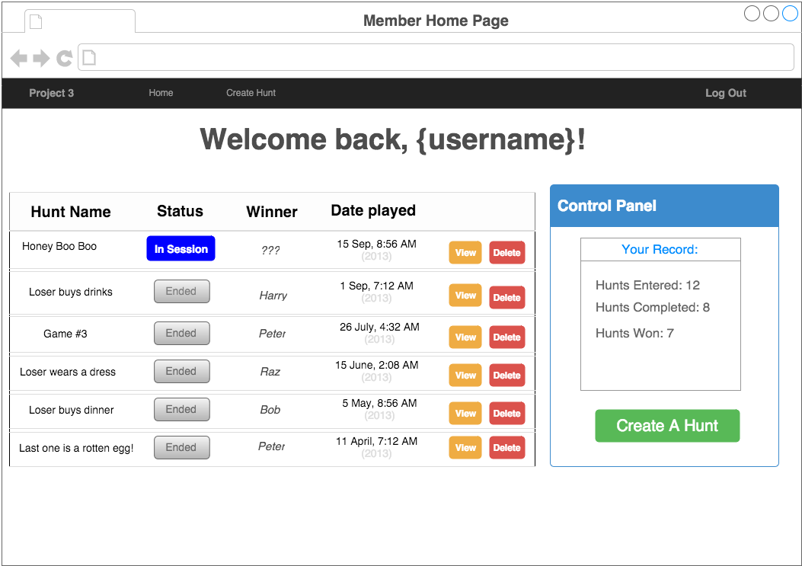
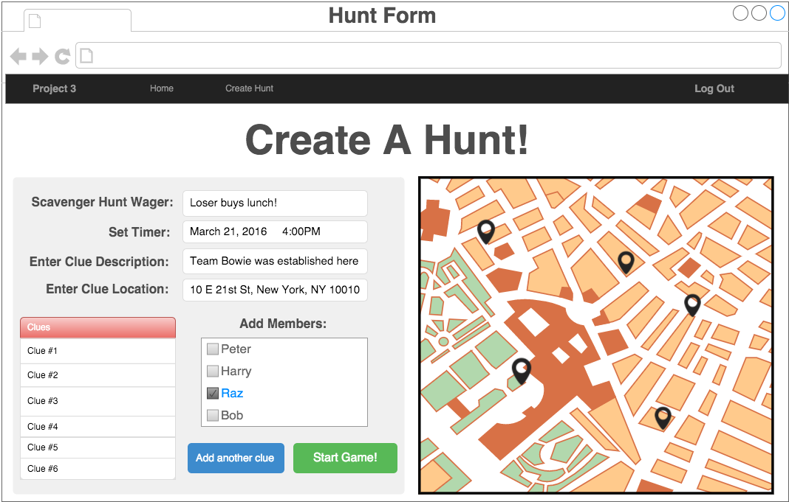
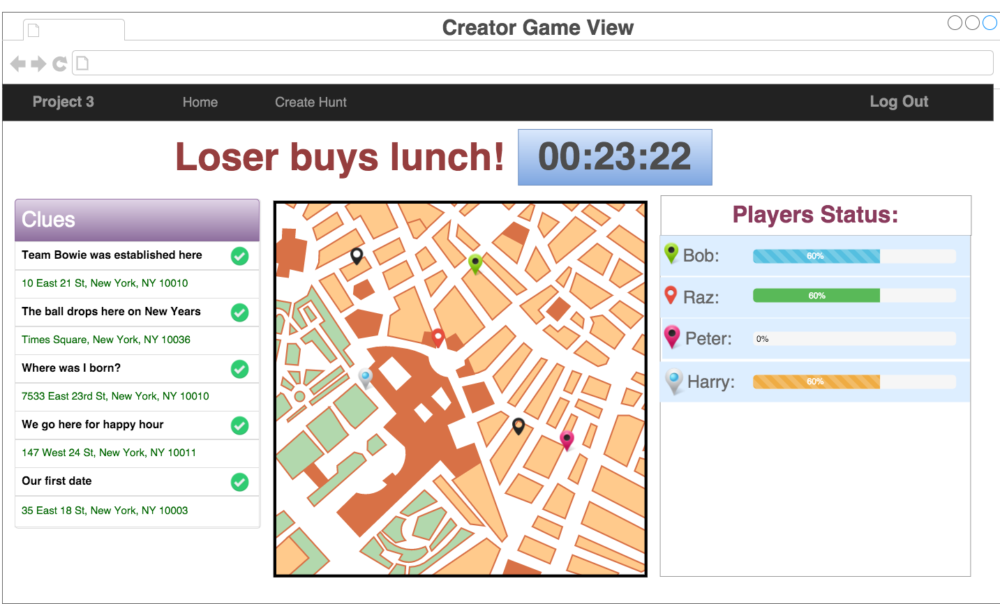
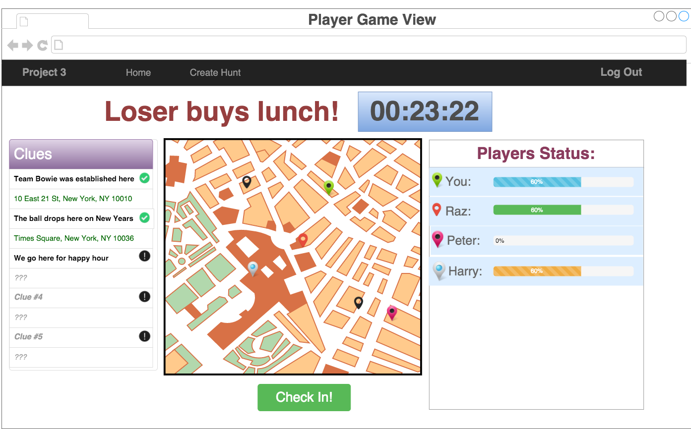

### Project #3: Citydipity
GA-Bowie Group Project

#

### Mission Statement
Fun way of exploring the areas around you with your friends

### Introduction
This application will allow you to make **scavenger hunts** while exploring the places around you and share the hunt with your friends or participate in scavenger-hunts created by your friends. You can create your own scavenger-hunt with clues leading to particular locations which will point to the next clue. You must be physically at the location in order to check-in.The last person to complete all the clues looses.

---

### Technologies Used(To be updated):
* HTML/CSS
* JavaScript
* Node.js
* Express.js
* Postgres/SQL
* node modules -brcrypt,pg,body-parser,dotenv,morgan,express-session,pg-promise,path
* React

---

### Installation Instructions(To be Added):

---

### User Stories version 1:
#### Authentication
* As a guest, there should be a landing page that allows me to sign up/login for the application
* As a guest, I should be able to sign up for the application
* As a member, I should be able to log in if i already have an account
* As a member, after I log-in, the page should be welcoming and it should let me complete most of the application functions from this page
* As a member, my homepage should let me create new hunts
* As a member, my homepage should let me see the hunts that I am a part of
* As a member, I should be able to log out of the application

#### Creating a New Scavenger Hunt
* As a member, I should be able make a new scavenger hunt
* As a creator, I should be able to add clues to the scavenger hunt that I have created
* As a creator, I should be able to add location and text associated to a clue
* As a creator, I should be able to set the end time for the hunt
* As a creator, I should be able to share my scavenger hunt with other users/friends

#### Tracking Progress of Scavenger-hunts I created
* As a creator, I should be able to see the scavenger hunts that I have created
* As a creator, I should be able to track the progress of all the people participating in the hunt
* As a creator, I should be able to see the time left until the end of the hunt
* As a creator, I should be able to see all the clues associated with the hunt
* As a creator, I should be able to delete clues
* As a creator, I should be able to edit the clues
* As a creator, I should be able to deactivate/end the hunt

#### Tracking Progress of Scavenger-hunts I am a member of
* As a player, I should be able to see all the hunts that I have completed
* As a player, I should be able to see the clues that I have completed in a hunt
* As a player, I should be able to see the hunt I am currently participating in
* As a player, I should be able to see the hunt I am currently participating in
* As a player, I should be able to see the progress of all the players in the hunt
* As a player, I should be able to check-in to the location associated with a particular clue
* As a player, I should be able to see the time left until the end of the hunt
* As a player when I check-in to a location, I should know if it is right location associated with that particular clue
* As a player when I complete the hunt, I should get a notification saying that I finished the hunt

---

### DataBase Design:
#### Entity Relationship Diagram version 1:
#


### Wireframes version 1(To be Added):

#### Sign in | Log in Page
#

#### Member Home Page
#

#### Creating New Scavenger Hunt & Clues Page
#

#### Creator Game View Page
#

#### Player Game View Page
#

---

### Views Used:
* index.html - Renders the signup page/login page, with data dynamically rendering on the client-side

---

### Routes:

#### HTML (front-end) Routes ####

| Routes | Components |
| ------ | ---------- |
| GET / | Redirect to Login/Signup |
| GET /login | Login |
| GET /signup | Login |
| GET /logout | None |
| GET /hunts | HuntList |
| GET /hunts/new | HuntForm |
| GET /hunts/:id | HuntShow |

#### Users JSON Routes ####

Summary Table:

| Routes | Auth |
| ------ | ---- |
| POST /api/v1/users | NO   |
| POST /api/v1/users/login | NO |
| GET /api/v1/users | NO |

Request (POST /api/v1/users/login & POST /api/v1/users):
```
{
  username: String,
  password: String
}
```

Response:
```
 {
   success: true,
   data: {
     token: String
   }
 }
```

Params GET /api/v1/users:
* me = true - return only the current user
* Example ```/api/v1/users?me=true```

Response (GET /api/v1/users):
{
  success: true,
  data: [
    {user_id: Number, username: String}, ...
  ]
}

#### Scavenger Hunts JSON Routes ####

Summary Table:

| Routes | Auth |
| ------ | ---- |
| GET /api/v1/hunts | YES |
| GET /api/v1/hunts/:id | YES |
| POST /api/v1/hunts | YES |
| PUT /api/v1/hunts/:id | YES |
| DELETE /api/v1/hunts/:id | YES |

Request (PUT/POST api/v1/hunts):
```
{
   wager: String,
   deadline: datetime,
   participants: [Number, ...], // By user_id
   clues: [
    {
      description: String,
      clue_number: Number,
      lat: Number,
      lng: Number
    }, ...
  ]
 }
 ```

Response (GET /hunts ):
```
{
  success: true,
  data: [
    {
      hunt_id: Number,
      isOwner: Boolean,
      wager: String,
      winner: String,
      deadline: datetime
    }, ...
  ]
}
```
Params GET api/v1/hunts/:id
* lat: Latitude in decimal degrees
* lng: Longitude in decimal degrees
* Example: ```/api/v1/hunts/:id?lat=25.07656&lng=-80.37478```

Response (GET/PUT api/v1/hunts/:id & POST /api/v1/hunts):
 ```
 {
   success: true,
   data: {
     hunt_id: Number,
     isOwner: Number,
     wager: String
     deadline: datetime,
     participants: [
     {
      participant_id: Number,
      username: String,
      progress: Number // Generated from clue-users table  
     }, ...],
     clues: [
      {
        clue_id: Number,
        clue_number: Number,
        description: String,
        lat: Number,
        lng: Number
      }, ...
     ]
   }
 }
 ```

 Response (DELETE):

{success: true}


---

### Future Implementations(To be Added):
